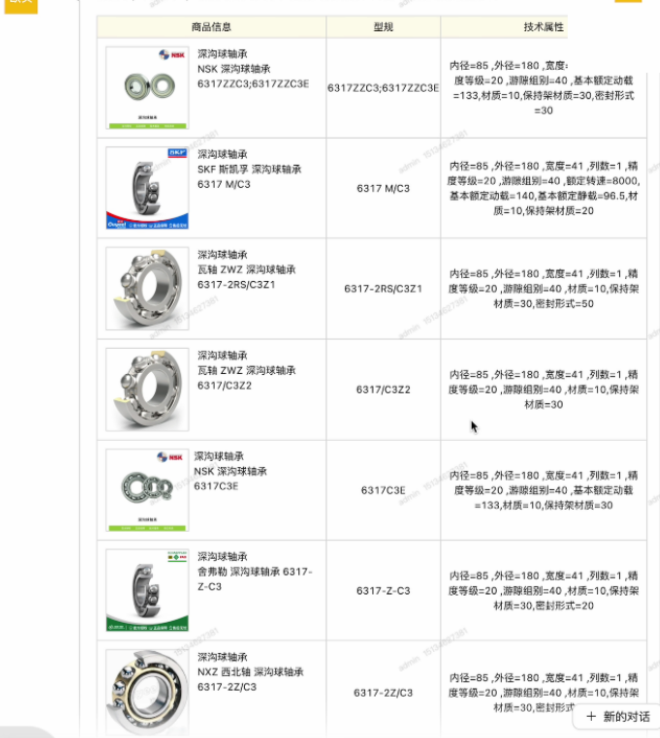

# 对比和之前做钢铁行业销售助手有什么区别
1. 工业品助手对于商品的属性的完整性要求与婚礼销售助手不同
2. 钢铁销售助手有一个数据库，可以在推荐阶段调用后端api，直接根据后台产品的最新数据进行推荐(商品属性，图片，链接)

# 需要提供的新资料
1. 对于每个商品，销售根据经验对属性重要进行排序，可以让模型更好的利用，最好对这些属性进行通俗的解释
2. 相关流程的视频和图片。
3. 获取门店实时信息的api

# 推荐一个销售，流程沟通
1. 订酒店+婚庆->订四大人员->拍婚纱照
2. 不需要将询问用户需求与商品的推荐的功能完全分离，可以在关键问题问完之后就进行相应的推荐
3. 推荐过程中最好添加图片和视频的形式，尽可能高效的方式吸引用户

