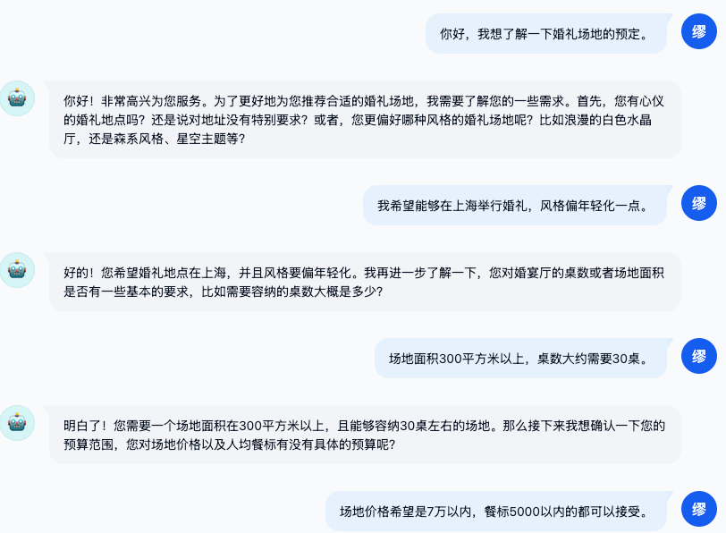
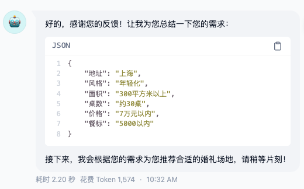
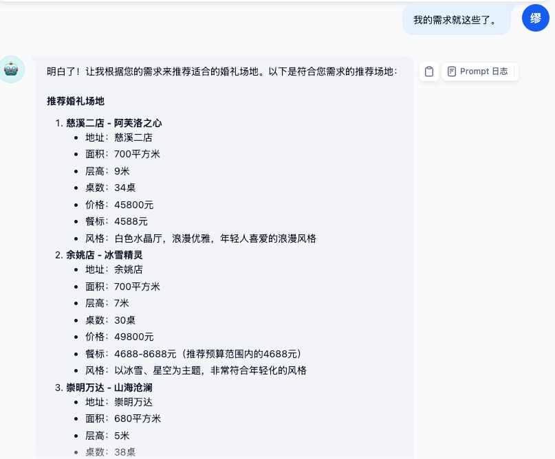
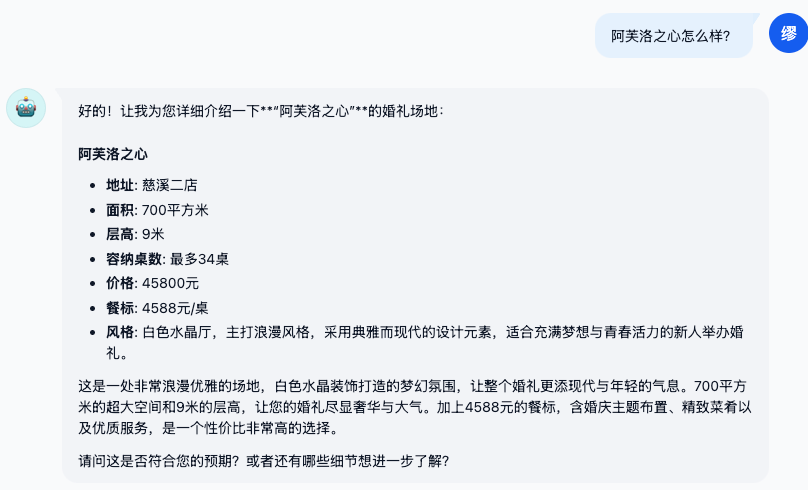
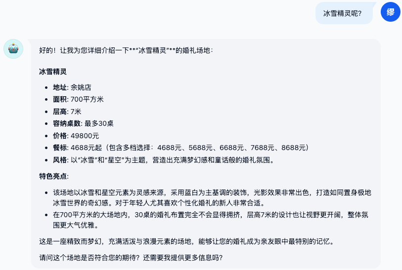
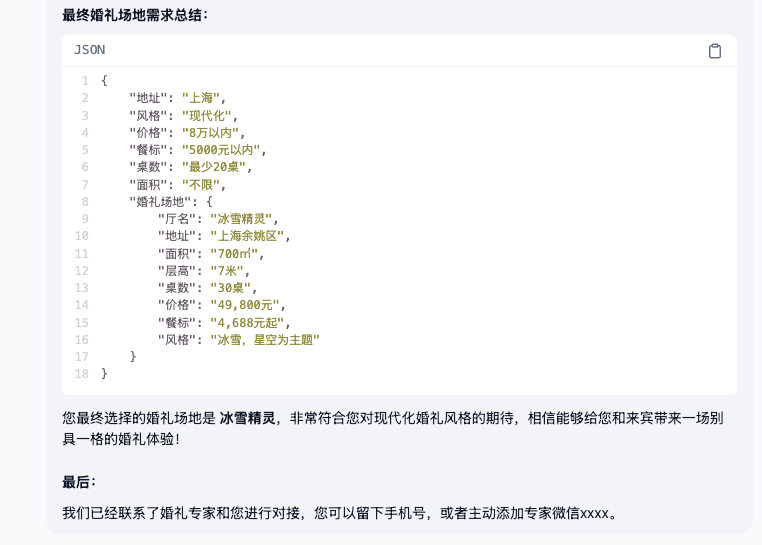

# 工作流程
1. 用户需求信息获取
    1. 结合场地的基本信息，引导用户提出需求
      
    2. 将用户的需求进行结构化的总结
      

2. 婚礼场地推荐  
   1. 粗略推荐
      1. 结合用户的需求，进行粗略的场地推荐(推荐多个符合用户要求的地点)，请求用户对感兴趣场地进行选择
      
   2. 精细推荐
      1. 根据用户的选择对婚礼场地进行更详细的介绍 
      
      
3. 终止对话
   1. 总结用户的最终需求(有需求的话可以发送给销售后台)，同时给定用户销售的联系方式，方便用户进一步了解详情
   

